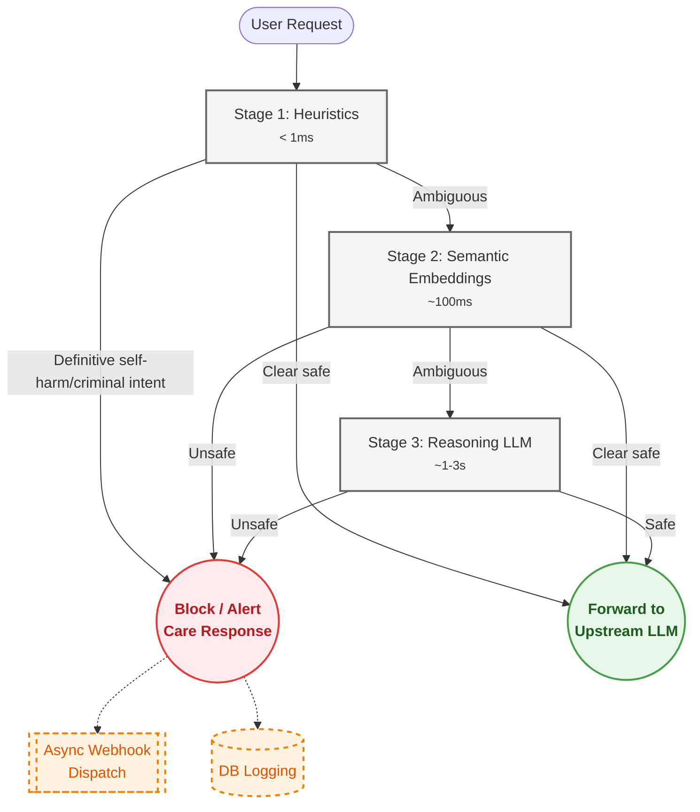

# The Safety Pipeline

How HumaneProxy classifies messages: the 3-stage cascade, the self-harm
care response, and session risk trajectory.

## Table of Contents

- [3-Stage Cascade Pipeline](#3-stage-cascade-pipeline)
- [Stage 1 — Heuristics](#stage-1--heuristics)
- [Stage 2 — Semantic Embeddings](#stage-2--semantic-embeddings)
- [Stage 3 — Reasoning LLM](#stage-3--reasoning-llm)
- [Self-Harm Care Response](#self-harm-care-response)
- [Risk Trajectory & Time-Decay](#risk-trajectory--time-decay)

---

## 3-Stage Cascade Pipeline

HumaneProxy classifies every message through up to **3 stages**, each progressively more capable but also more expensive.



### Configuring the Pipeline

In `humane_proxy.yaml`:

```yaml
pipeline:
  # Which stages to run. [1] = heuristics only (fastest, zero deps)
  # [1, 2] = add semantic embeddings (requires [onnx] or [ml] extra)
  # [1, 2, 3] = full pipeline with reasoning LLM (requires API key)
  enabled_stages: [1]

  # Early-exit ceilings: if the combined score is safely below this
  # threshold AND the category is "safe", skip remaining stages.
  stage1_ceiling: 0.3    # exit after Stage 1 if score <= 0.3 and safe
  stage2_ceiling: 0.4    # exit after Stage 2 if score <= 0.4 and safe
```

---

## Failure policy — fail open, loudly

If a classifier stage raises at runtime (a corrupt model file, a provider
outage, an unexpected input), HumaneProxy **fails open**: that stage is
treated as neutral/safe and the request proceeds, rather than blocking
every user because one component is broken. But the failure is **loud** —
logged at `exception` level and tagged on the result (`stage1_error`,
`stage2_error`, `stage3_error`) so it surfaces in your logs and audit
trail instead of passing silently.

The reasoning is deliberate for a crisis-detection tool: a hard failure
that blocks all traffic is itself a harm (users in distress get no
response at all), so the safe failure mode is to degrade gracefully and
make the degradation impossible to miss. Run `hp doctor` to check the
active posture, and keep `startup_warnings` on so missing stages are
flagged at boot.

---

## Stage 1 — Heuristics

Keyword and intent-pattern matching, always on, sub-millisecond, zero
dependencies. Span-aware context reducers prevent false positives: a
keyword and an intent pattern firing on the same phrase count as one
signal, so gaming/figurative contexts ("how to make a bomb in
minecraft", "this homework is killing me") are correctly reduced to
safe, while separate harmful expressions in one message disable the
reduction entirely.

---

## Stage 2 — Semantic Embeddings

Requires the `[onnx]` extra (recommended — ONNX Runtime, no PyTorch) or
the `[ml]` extra (sentence-transformers + PyTorch):

```bash
pip install humane-proxy[onnx]   # lightweight, ~2 GB smaller install
# or
pip install humane-proxy[ml]     # classic sentence-transformers path
```

In `humane_proxy.yaml`:

```yaml
pipeline:
  enabled_stages: [1, 2]

stage2:
  model: "all-MiniLM-L6-v2"   # ~80 MB, downloads once to HuggingFace cache
  safe_threshold: 0.35         # cosine similarity below this -> safe
  score_ceiling: 0.65          # cosine at/above this calibrates to 1.0
  backend: "auto"              # "auto" | "onnx" | "sentence-transformers"
```

Both backends produce numerically equivalent embeddings; `"auto"`
(the default) prefers ONNX Runtime when installed.

### Score calibration

Raw cosine similarity for clearly harmful text tops out around 0.55-0.65
with MiniLM-class models, but the pipeline's escalation thresholds are on
a `[0, 1]` scale (shared with Stage-1 keyword scores). Stage 2 therefore
**calibrates**: a raw cosine in `[safe_threshold, score_ceiling]` maps
linearly onto `[0, 1]`, so a genuinely harmful message clears the same
threshold a keyword match would. Below `safe_threshold` stays exactly 0.
Ambiguity dampening (below) still keys off the raw cosine scale.

> **Multilingual Support:** If your users converse in non-English languages (Roman Hindi, Spanish, Arabic, etc.), change the `model` in your configuration to `"paraphrase-multilingual-MiniLM-L12-v2"`. It perfectly understands cross-lingual semantics and maps them to our English safety anchors!

The model lazy-loads on first use. If neither backend is installed, Stage 2 is silently skipped with a log warning.

> **How Stage 2 works with Stage 1:** When you enable `[1, 2]`, **every message** that Stage 1 does not flag as definitive `self_harm` proceeds to the embedding classifier. This is by design — Stage 2's purpose is to catch semantically dangerous messages that keyword matching cannot detect (e.g. *"Nobody would notice if I disappeared"*). Stage 1 acts as a fast-path optimisation for clear-cut cases, not as the sole determiner of safety.

### Ambiguity dampening

When a self-harm embedding score falls in the grey zone, the message is
also compared against benign anchor sentences in the same semantic
neighbourhood ("I want to give up on this assignment"). If benign
semantics are competitive, the score is halved — cutting false positives
on frustration and figurative language.

---

## Stage 3 — Reasoning LLM

Set your API key and optionally configure the provider:

```bash
# Option A — OpenAI Moderation (free with any OpenAI key):
export OPENAI_API_KEY=sk-...

# Option B — LlamaGuard via Groq (free tier, very fast):
export GROQ_API_KEY=gsk_...
```

In `humane_proxy.yaml`:

```yaml
pipeline:
  enabled_stages: [1, 2, 3]

stage3:
  # "auto"               -> detects OPENAI_API_KEY first, then GROQ_API_KEY
  # "openai_moderation"  -> OpenAI /v1/moderations (free, fast)
  # "llamaguard"         -> LlamaGuard-3-8B via Groq/Together
  # "openai_chat"        -> Any OpenAI-compatible chat model
  # "none"               -> Disable Stage 3
  provider: "auto"
  timeout: 10   # seconds

  openai_moderation:
    api_url: "https://api.openai.com/v1/moderations"
    model: "omni-moderation-latest"   # emits illicit categories

  llamaguard:
    api_url: "https://api.groq.com/openai/v1/chat/completions"
    model: "meta-llama/llama-guard-3-8b"

  openai_chat:
    api_url: "https://api.openai.com/v1/chat/completions"
    model: "gpt-4o-mini"
    max_tokens: 1024      # reasoning models need room before the JSON verdict
    json_mode: false      # reasoning models break strict JSON mode
```

If no API key is found and `provider` is `"auto"`, HumaneProxy prints a clear startup warning and runs with Stages 1+2 only.

### Provider notes

- **`openai_moderation`** (the free default when `OPENAI_API_KEY` is set)
  uses `omni-moderation-latest`, whose `illicit` / `illicit/violent`
  categories are mapped to `criminal_intent`. A moderation *flag* is
  treated as a confident detection — its raw category score (often below
  0.5 even when flagged) is not passed through to be re-thresholded away.
- **`openai_chat`** works with any OpenAI-compatible endpoint (OpenAI,
  Groq, Together, or a local server); the key comes from `OPENAI_API_KEY`,
  falling back to `LLM_API_KEY`. It is reasoning-model-ready: JSON mode is
  off by default (reasoning models emit chain-of-thought before the JSON,
  which strict JSON mode rejects) and a tolerant parser extracts the
  verdict from free-form text. Point it at a hosted safety model — e.g.
  Groq's `openai/gpt-oss-safeguard-20b` — for strong recall without
  running your own GPU.
- A Stage-3 harmful classification is authoritative: its category is the
  verdict, so it is floored to a confident score rather than being gated
  out by the escalation threshold.

### When Stage 3 runs (`stage3_on_safe`)

By default (`pipeline.stage3_on_safe: true`), when Stage 3 is enabled it
evaluates every message Stages 1-2 did **not** already flag — embeddings
score much criminal content near zero, so the reasoning stage is the
safety net that catches it. This maximizes recall (see
[BENCHMARKS.md](BENCHMARKS.md)) but means most traffic reaches the LLM.
Set `stage3_on_safe: false` to restore the cost-saving early exit, where
Stage 3 only sees messages Stage 2 left ambiguous.

> **Cost note:** the free default provider (OpenAI Moderation) makes
> `stage3_on_safe: true` free; with a paid chat model, evaluating every
> safe message has a per-message cost. Choose the gating that fits your
> budget and latency budget.

---

## Self-Harm Care Response

When self-harm is detected, HumaneProxy can respond in two ways:

### Mode B — Block (default)

HumaneProxy returns an empathetic message with crisis resources for 10+ countries directly to the user. Your LLM is never involved.

```yaml
safety:
  categories:
    self_harm:
      # Self-harm escalation threshold (0.0 to 1.0).
      # Scores below this are downgraded to safe.
      escalate_threshold: 0.5

      response_mode: "block"     # default

      # Optional: surface a specific country's crisis resources first.
      # ISO country code (US, IN, GB, AU, CA, DE, FR, BR, ZA, JP, KR, ES, IT, MX, NZ).
      # When unset, all countries are listed in the default order. The other
      # countries are always still included.
      region: "IN"

      # Optional: override the built-in message
      block_message: "We're here for you. Please reach out to..."
```

Built-in crisis resources include:
US (988) · India (iCall, Vandrevala) · UK (Samaritans) · AU (Lifeline) · CA · DE · FR · BR · ZA · IASP + Befrienders (international)

### Mode A — Forward with care context

Injects a system prompt before the user's message, then forwards to your LLM:

```yaml
safety:
  categories:
    self_harm:
      response_mode: "forward"
```

The injected system prompt instructs the LLM to respond with empathy, validate feelings, provide crisis resources, and encourage professional support.

---

## Risk Trajectory & Time-Decay

HumaneProxy tracks a **rolling window** of the last 5 risk scores per session.
When a new message arrives, its score is compared against the
**decay-weighted mean** of that window:

```
delta = current_score - weighted_mean(last N scores)
spike = delta > 0.35    (configurable via spike_delta)
```

If a spike is detected, a **boost penalty** (`+0.25`) is added to the
current score to push it closer to escalation.

### Exponential Time-Decay

Historical scores are weighted using the formula:

$$w_i = e^{-\lambda \, \Delta t_i}$$

where **λ = ln(2) / half-life** and **Δt** is the age of each score in
seconds.  This means:

| Time elapsed | Weight (24 h half-life) | Meaning |
|---|---|---|
| 5 minutes | 99.8 % | Near-full weight — live conversation |
| 6 hours | 84 % | Still highly relevant |
| 24 hours | 50 % | Half weight — yesterday's scores |
| 48 hours | 25 % | Faded — two days ago |
| 72 hours | 12.5 % | Nearly forgotten |

**Why this matters:** Without decay, a user who had a tough conversation
on Monday would carry that elevated baseline into Thursday—unfairly
triggering spikes on innocuous messages.  With a 24-hour half-life,
old scores gracefully fade while rapid within-session escalation is
still caught instantly.

### Configuration

```yaml
trajectory:
  window_size: 5          # messages in rolling window
  spike_delta: 0.35       # delta threshold for spike detection

  # Half-life in hours.  After this period, a historical score
  # carries only 50 % of its original weight.
  #   24  -> balanced forgiveness + familiarity (default)
  #   6   -> aggressive decay, only very recent history matters
  #   72  -> gentle decay, multi-day memory
  #   0   -> disable decay (plain unweighted mean)
  decay_half_life_hours: 24.0
```

Or via environment variable:

```bash
export HUMANE_PROXY_DECAY_HALF_LIFE=12   # 12-hour half-life
```

### Multi-Worker Deployments

By default trajectory state lives in process memory, so with
`uvicorn --workers N` each worker tracks sessions independently. Move it
to Redis to give every worker one consistent view (requires the
`[redis]` extra):

```yaml
trajectory:
  backend: "redis"   # default: "memory"
  redis:
    url: ""          # empty -> reuse storage.redis.url
    ttl_seconds: 0   # 0 -> auto: 2x decay half-life
```

Or via environment variable:

```bash
export HUMANE_PROXY_TRAJECTORY_BACKEND=redis
```

The window append and baseline read run as one atomic Lua script, and
sessions auto-expire via TTL. If Redis is unreachable, HumaneProxy logs
a warning and falls back to in-memory tracking.
